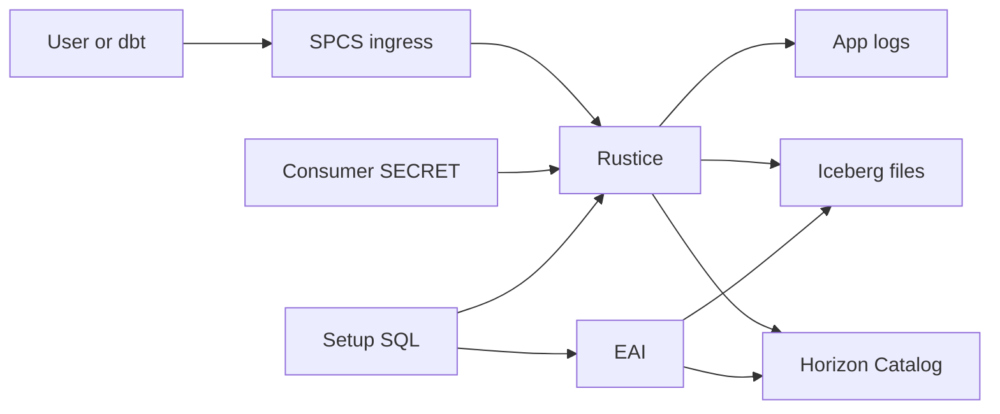

# Rustice Native App with SPCS

This directory is the first Snowflake Native App packaging scaffold for running
the Rustice container as a Snowpark Container Services service in a consumer
account.

The existing `deploy/spcs` scripts are still the fastest way to deploy directly
from a repository checkout. This Native App package is the Marketplace/private
listing path: the provider publishes an application package, and the consumer
installs and activates it from Snowsight.

## Current Scope

This scaffold packages the same `embucketd` container service that
`deploy/spcs/deploy.sh` creates:

- one `CPU_X64_XS` compute pool by default
- public ingress endpoint on port `3000`
- `executeAsCaller: true`
- Rustice trusted SPCS ingress mode
- Horizon/Snowflake REST Catalog settings passed as service environment
- a consumer-approved `SECRET` reference mounted through `ICEBERG_REST_CREDENTIAL_FILE`

The Horizon auth path mirrors the direct SPCS deploy: Rustice receives a
Horizon-compatible credential from a Snowflake `GENERIC_STRING` secret, exchanges
it for a short-lived Horizon/Snowflake REST Catalog access token, and refreshes
that token before it expires. In Native App form the app never creates or owns
that secret directly. The consumer creates or selects the secret, then binds it
to the app reference named `horizon_credential_secret`.

## Architecture



Trust boundaries:

- The public endpoint is protected by Snowflake SPCS ingress. The container runs
  with `executeAsCaller: true` and Rustice trusted ingress mode.
- The app does not create or own the Horizon credential. The consumer binds a
  `GENERIC_STRING` Snowflake `SECRET` through the `horizon_credential_secret`
  reference, and Snowflake mounts it into the service container as a file.
- Egress is restricted to the consumer Snowflake account host, the configured
  object-store host, and optional extra hosts passed to
  `APP_PUBLIC.CONFIGURE_EXTERNAL_ACCESS`.
- The app does not store consumer data outside the consumer account. Query
  results are returned to the caller; operational logs remain in Snowflake
  service logs.

## Provider Setup

Create a provider-side image repository outside the application package and
push the Rustice image there. Native Apps with containers cannot reference
Docker Hub directly.

```bash
snow --config-file /path/to/.snowflake/config.toml sql -c snowflake -q "
CREATE DATABASE IF NOT EXISTS RUSTICE_NATIVE_APP_IMAGES;
CREATE SCHEMA IF NOT EXISTS RUSTICE_NATIVE_APP_IMAGES.PUBLIC;
CREATE IMAGE REPOSITORY IF NOT EXISTS RUSTICE_NATIVE_APP_IMAGES.PUBLIC.RUSTICE_REPO;
"

snow --config-file /path/to/.snowflake/config.toml spcs image-registry login -c snowflake

docker build --platform linux/amd64 -t rustice-native-app:latest /path/to/rustice
docker tag rustice-native-app:latest \
  <org>-<account>.registry.snowflakecomputing.com/rustice_native_app_images/public/rustice_repo/rustice:latest
docker push \
  <org>-<account>.registry.snowflakecomputing.com/rustice_native_app_images/public/rustice_repo/rustice:latest
```

If you change the image repository database, schema, repository, image name, or
tag, update the image path in `app/manifest.yml` and the default image path in
`app/setup_script.sql`.

## Local App Test

From this directory:

```bash
snow app run --config-file /path/to/.snowflake/config.toml -c snowflake
```

After the development application is created, grant the account privileges that
SPCS requires if they were not granted automatically from `manifest.yml`:

```sql
GRANT CREATE COMPUTE POOL ON ACCOUNT TO APPLICATION RUSTICE_NATIVE_APP;
GRANT BIND SERVICE ENDPOINT ON ACCOUNT TO APPLICATION RUSTICE_NATIVE_APP;
GRANT CREATE EXTERNAL ACCESS INTEGRATION ON ACCOUNT TO APPLICATION RUSTICE_NATIVE_APP;
```

Configure external access:

```sql
CALL RUSTICE_NATIVE_APP.APP_PUBLIC.CONFIGURE_EXTERNAL_ACCESS(
  'RUSTICE_SPCS',
  'ACCOUNTADMIN',
  'rustice_spcs',
  'public_snowplow_manifest',
  'public_snowplow_manifest,public_snowplow_manifest_derived,public_snowplow_manifest_scratch,public_snowplow_manifest_snowplow_manifest',
  '',
  'us-east-2',
  'embucket-testdata.s3.us-east-2.amazonaws.com'
);

SHOW SPECIFICATIONS IN APPLICATION RUSTICE_NATIVE_APP;

ALTER APPLICATION RUSTICE_NATIVE_APP
  APPROVE SPECIFICATION RUSTICE_EXTERNAL_ACCESS
  SEQUENCE_NUMBER = <sequence_number>;
```

Create or reuse a Snowflake secret containing the Horizon credential. For local
development this can be the same role-restricted PAT secret that
`deploy/spcs/deploy.sh` creates. For a clean account, create a service user,
issue a role-restricted PAT, store only the returned `token_secret` in a
`GENERIC_STRING` secret, and bind that secret to the Native App reference:

```sql
CREATE DATABASE IF NOT EXISTS RUSTICE_NATIVE_APP_CONFIG;
CREATE SCHEMA IF NOT EXISTS RUSTICE_NATIVE_APP_CONFIG.SECRETS;

CREATE USER IF NOT EXISTS RUSTICE_HORIZON_SVC
  TYPE = SERVICE
  DEFAULT_ROLE = <horizon_role>;

GRANT ROLE <horizon_role> TO USER RUSTICE_HORIZON_SVC;

CREATE AUTHENTICATION POLICY IF NOT EXISTS RUSTICE_NATIVE_APP_CONFIG.SECRETS.RUSTICE_HORIZON_PAT_AUTH_POLICY
  PAT_POLICY = (
    NETWORK_POLICY_EVALUATION = ENFORCED_NOT_REQUIRED
    REQUIRE_ROLE_RESTRICTION_FOR_SERVICE_USERS = TRUE
  );

ALTER USER IF EXISTS RUSTICE_HORIZON_SVC
  SET AUTHENTICATION POLICY RUSTICE_NATIVE_APP_CONFIG.SECRETS.RUSTICE_HORIZON_PAT_AUTH_POLICY
  FORCE;

ALTER USER IF EXISTS RUSTICE_HORIZON_SVC
  ADD PROGRAMMATIC ACCESS TOKEN RUSTICE_HORIZON_PAT
  ROLE_RESTRICTION = '<horizon_role>'
  DAYS_TO_EXPIRY = 15;

SELECT "token_secret" FROM TABLE(RESULT_SCAN(LAST_QUERY_ID()));

CREATE OR REPLACE SECRET RUSTICE_NATIVE_APP_CONFIG.SECRETS.HORIZON_CREDENTIAL
  TYPE = GENERIC_STRING
  SECRET_STRING = '<token_secret returned above>';

SHOW REFERENCES IN APPLICATION RUSTICE_NATIVE_APP;

CALL RUSTICE_NATIVE_APP.APP_PUBLIC.REGISTER_REFERENCE(
  'horizon_credential_secret',
  'ADD',
  SYSTEM$REFERENCE(
    'SECRET',
    'RUSTICE_NATIVE_APP_CONFIG.SECRETS.HORIZON_CREDENTIAL',
    'PERSISTENT',
    'READ'
  )
);
```

Then start the service:

```sql
CALL RUSTICE_NATIVE_APP.APP_PUBLIC.START_APP();
CALL RUSTICE_NATIVE_APP.APP_PUBLIC.SERVICE_STATUS();
CALL RUSTICE_NATIVE_APP.APP_PUBLIC.SERVICE_ENDPOINTS();
CALL RUSTICE_NATIVE_APP.APP_PUBLIC.SERVICE_LOGS(100);
CALL RUSTICE_NATIVE_APP.APP_PUBLIC.SERVICE_PREVIOUS_LOGS(100);
```

The arguments are:

- `horizon_database`: Snowflake database backing the Horizon catalog prefix.
- `horizon_role`: role/scope to use for Horizon access. `ACCOUNTADMIN` is only
  a convenient local development value. Production deployments should use a
  dedicated role, and the bound PAT must be created with the same
  `ROLE_RESTRICTION` value.
- `client_database`: SQL catalog name exposed by Rustice.
- `client_schema`: default SQL schema exposed by Rustice.
- `horizon_schemas`: comma-separated schemas to bootstrap lazily.
- `horizon_tables`: comma-separated `schema.table` names to bootstrap lazily.
- `s3_region`: AWS region for `COPY INTO s3://...` sources.
- `extra_egress_hosts`: comma-separated hosts in addition to the Snowflake
  account host and regional S3 host.
- `horizon_credential_secret`: app reference to a `GENERIC_STRING` secret whose
  value is the Horizon-compatible credential. The service mounts it as a file
  and points Rustice to it with `ICEBERG_REST_CREDENTIAL_FILE`.

The `horizon_role` argument and the PAT `ROLE_RESTRICTION` must match. If they
do not match, Horizon token exchange fails with `unauthorized_client`.

After the endpoint is ready, a smoke query can be sent through the patched
connector:

```bash
embucket-snow --config-file /path/to/generated/config.toml \
  sql -c embucket_spcs \
  --host <service>.snowflakecomputing.app \
  -q "SELECT 1"
```

Runtime validation in the development account confirmed that ingress auth and
the service role grants work: `SELECT 1` succeeds through the Native App public
endpoint. Horizon/Iceberg access was validated through the consumer-approved
`horizon_credential_secret` reference with:

```sql
SELECT COUNT(*) AS c FROM rustice_spcs.public_snowplow_manifest.events;
-- 125127
```

## Consumer Flow for a Private Listing

After the app package is attached to a private listing, the consumer installs it
from `Catalog -> Apps`, grants requested privileges, approves external access,
creates or selects a Horizon credential secret, binds the
`horizon_credential_secret` reference, and calls the same procedures:

```sql
CALL <installed_app>.APP_PUBLIC.CONFIGURE_EXTERNAL_ACCESS(...);
CALL <installed_app>.APP_PUBLIC.REGISTER_REFERENCE(
  'horizon_credential_secret',
  'ADD',
  SYSTEM$REFERENCE('SECRET', '<db>.<schema>.<secret>', 'PERSISTENT', 'READ')
);
CALL <installed_app>.APP_PUBLIC.START_APP();
CALL <installed_app>.APP_PUBLIC.SERVICE_ENDPOINTS();
CALL <installed_app>.APP_PUBLIC.SERVICE_LOGS(100);
CALL <installed_app>.APP_PUBLIC.SERVICE_PREVIOUS_LOGS(100);
```

The consumer then points `embucket-snow` or dbt at the returned public ingress
host. For dbt Snowplow, use the runbook in
`../test-dbt-snowplow-web/README.md` with:

```bash
export EMBUCKET_SPCS=1
export EMBUCKET_HOST="<service>.snowflakecomputing.app"
export EMBUCKET_PORT=443
export EMBUCKET_PROTOCOL=https
export EMBUCKET_DATABASE=rustice_spcs
export EMBUCKET_SCHEMA=public_snowplow_manifest
export EMBUCKET_THREADS=1
```

## Publish a Private Listing

1. Build and push the provider image.
2. Test the application package with `snow app run`.
3. Create a version/patch for the application package.
4. In Provider Studio, create a listing for `Specified Consumers`.
5. Choose product type `Native App` and attach the application package.
6. Add consumer organization/account identifiers.
7. Publish the private listing.

Container Native Apps require Snowflake Product Security approval and automated
container image scanning before listings can be published. If the target
consumer account is outside the provider organization, the application package
must also be eligible for `DISTRIBUTION = EXTERNAL`; Snowflake may need to
enable this on the provider account for Native Apps that use Snowpark Container
Services.

### External Consumers

Consumers in other Snowflake organizations require two provider-side gates:

1. Enable cross-cloud auto-fulfillment for the provider account with `ORGADMIN`:

   ```sql
   USE ROLE ORGADMIN;
   SELECT SYSTEM$IS_GLOBAL_DATA_SHARING_ENABLED_FOR_ACCOUNT('<provider_account_name>');
   SELECT SYSTEM$ENABLE_GLOBAL_DATA_SHARING_FOR_ACCOUNT('<provider_account_name>');
   ```

2. Ask Snowflake to approve the provider account for Snowflake Native Apps with
   Snowpark Container Services and `DISTRIBUTION = EXTERNAL`.

Without the second approval, publishing to an out-of-organization account fails
when setting external distribution on the application package:

```sql
ALTER APPLICATION PACKAGE RUSTICE_NATIVE_APP_PKG
  SET DISTRIBUTION = EXTERNAL;
```

Expected blocker before Snowflake approval:

```text
093197: Account is not allowed to create application package versions or patches
with Snowpark Container Services for EXTERNAL distribution
```

After Snowflake approves the provider account, set the package distribution,
wait for the automated security/container scan to pass, then publish the
private listing:

```sql
ALTER APPLICATION PACKAGE RUSTICE_NATIVE_APP_PKG
  SET DISTRIBUTION = EXTERNAL;

ALTER LISTING RUSTICE_NATIVE_APP_PRIVATE PUBLISH;
```

Adding more private consumers after that should only require adding their
`ORG.ACCOUNT` identifiers to the listing targets and refreshing/publishing the
listing metadata.

For a provider-side draft listing that is not submitted for review and is not
published, run:

```bash
snow --config-file /path/to/.snowflake/config.toml \
  sql -c snowflake \
  -f create_draft_listing.sql
```

The draft SQL uses `IFSMGKM.UIC40916` for the current consumer test account.
Replace it with the target consumer `ORG.ACCOUNT` identifier before submitting
or publishing a different private listing. It also enables listing
auto-fulfillment with `SUB_DATABASE_WITH_REFERENCE_USAGE`, which Snowflake
requires when the target consumer is outside the provider's current region.
Provider accounts must have global data sharing/auto-fulfillment enabled before
the script can create or update such a listing.
